Projet realise par : Yasmine Bourijal et Nessrine Bekri

<h1 align="center"> Plateforme E-Learning – Microservices Spring Boot</h1>

Ce projet est une architecture microservices permettant de gérer :
- les cours
- les enseignants
- les étudiants
- les inscriptions
- le routing via une API Gateway
- la découverte via Eureka Server

Chaque service expose une **API REST propre** en JSON.

---

##  1. Architecture des microservices

                     ┌────────────────────────┐
                     │   discovery-service    │
                     │      (Eureka 8761)     │
                     └─────────────▲──────────┘
                                   │
                      Service Discovery / Registry
                                   │
                     ┌─────────────┴──────────┐
                     │     gateway-service     │
                     │        (8888)           │
                     └─────────────┬──────────┘
                                   │ Routing
┌───────────────────────────────┼────────────────────────────────────────┐
│                               │                                        │
┌──▼─────────────────┐    ┌────────▼────────┐                ┌─────────────▼──────────┐
│ course-service     │    │ teacher-service │                │ student-service        │
│   (8081)           │    │   (8082)        │                │    (8084)              │
│ /api/courses       │    │ /api/teachers   │                │ /api/students          │
└─────────┬──────────┘    └────────┬─────────┘                └────────────┬───────────┘
│                         │                                        │
│                         │                                        │
└─────────────────────────▼────────────────────────────────────────┘
Calls via Feign
(course + student microservices)

                               ┌───────────────┐
                               │ enrollment-   │
                               │   service     │
                               │    (8083)     │
                               │ /api/enrol... │
                               └───────────────┘

---

##  2. Technologies utilisées

- **Spring Boot 3.3.4**
- **Spring Cloud 2023.0.3**
- **Spring Data JPA**
- **OpenFeign**
- **H2 Database**
- **Eureka Discovery**
- **API Gateway**
- **Java 17**
- **Maven**

---

##  3. Démarrage des microservices (ordre obligatoire)

1**Lancer discovery-service** (Eureka)  
--> http://localhost:8761

**Lancer course-service**
--> http://localhost:8081/api/courses

**Lancer teacher-service**
--> http://localhost:8082/api/teachers

**Lancer enrollment-service**   
--> http://localhost:8083/api/enrollments

**Lancer student-service**
--> http://localhost:8084/api/students

**Lancer gateway-service**  
--> http://localhost:8888/

---

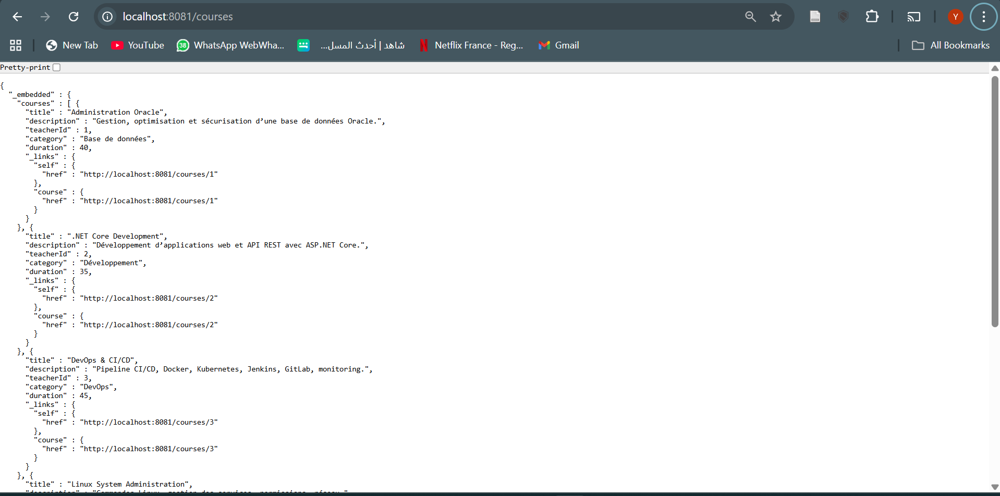

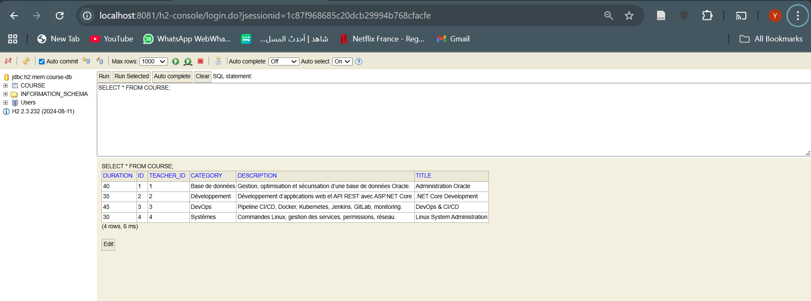

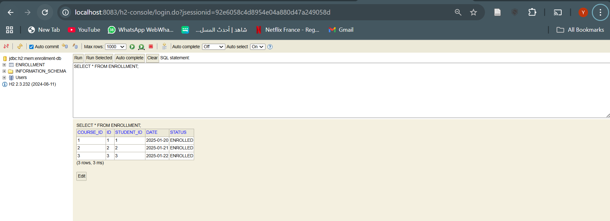

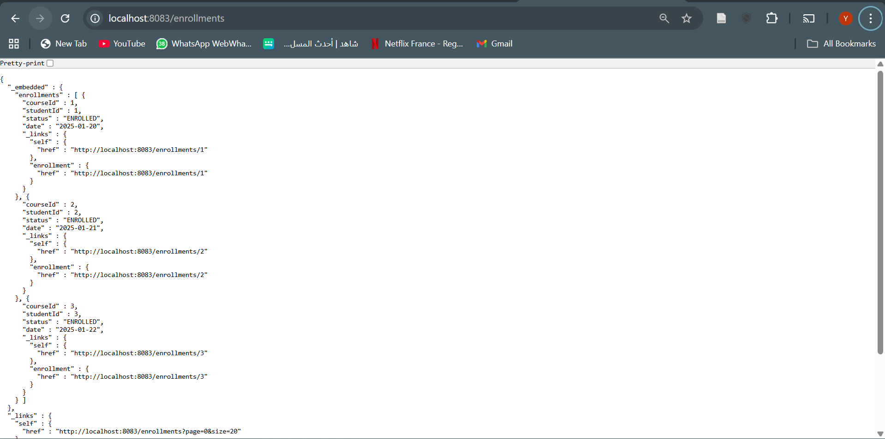

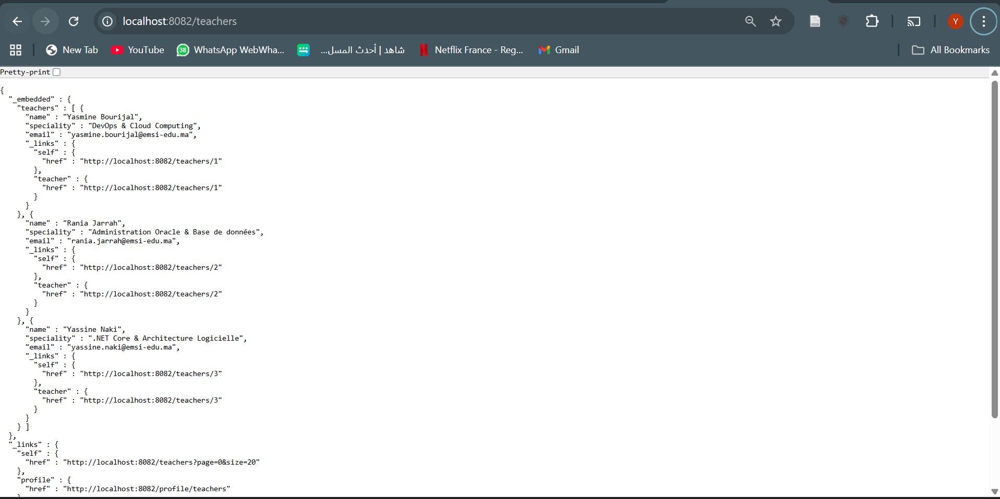

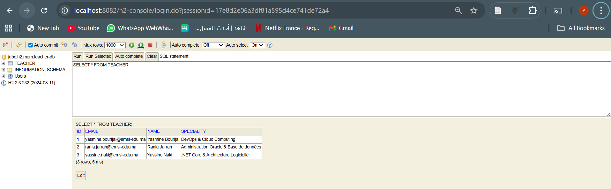

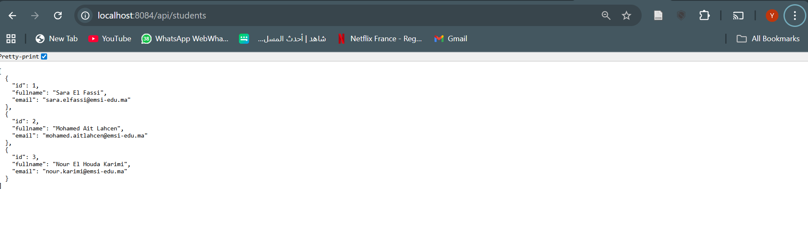

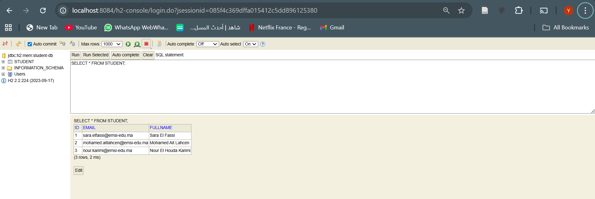

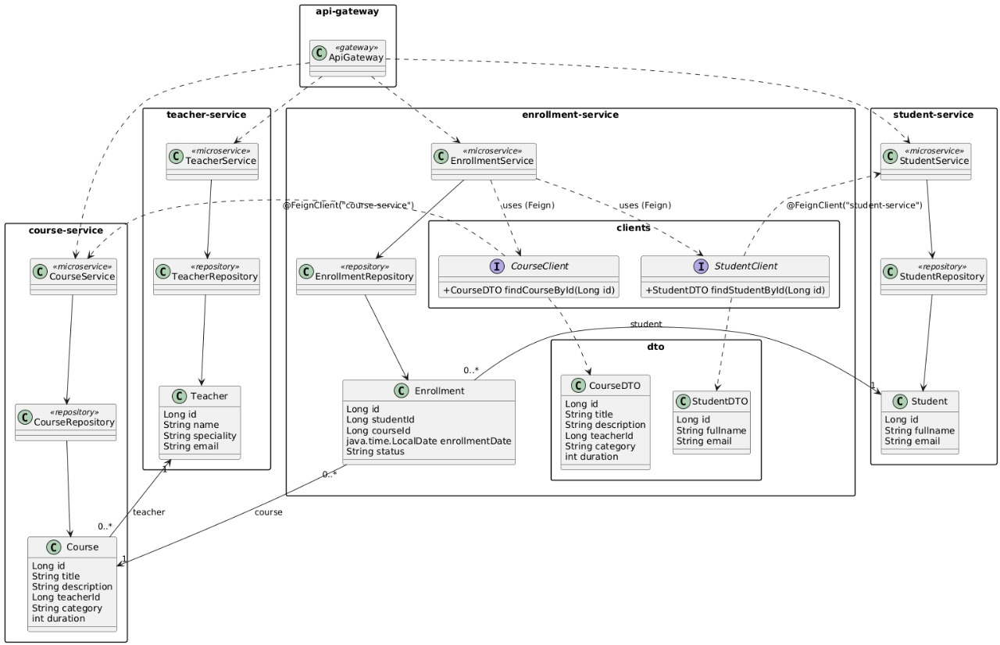

On a intégré un WebClient dans le microservice course-service afin de permettre la récupération dynamique de contenus externes. Le service interroge l’API YouTube Data API v3 pour rechercher des vidéos pédagogiques liées aux cours (ex : Java, DevOps, Microservices…). Un endpoint REST /api/courses/youtube/search a été ajouté pour exposer ces résultats.

Tester la recherche YouTube (WebClient)--> http://localhost:8081/api/courses/youtube/search?q=java&maxResults=1
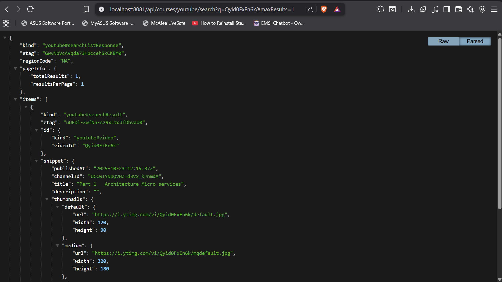
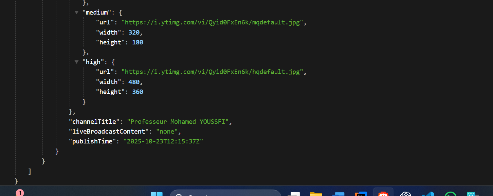


###  Extension : microservice `certificate-service` (certificats PDF)

Nous avons ajouté un microservice `certificate-service` dédié à la génération de certificats de réussite au format PDF.  
Les tests ont été réalisés avec Postman :

1. **Création d’un certificat**
    - **Méthode** : `POST`
    - **URL** : `http://localhost:8086/api/certificates`
    - **Body (JSON)** :
      ```json
      {
        "studentId": 1,
        "courseId": 2,
        "studentName": "Rania Ben Abdellah",
        "courseTitle": "Architecture Microservices"
      }
      ```
    -  La réponse contient l’objet `Certificate` avec le champ `pdfData` (contenu du PDF encodé en Base64).

2. **Téléchargement du certificat au format PDF**
    - **Méthode** : `GET`
    - **URL** : `http://localhost:8086/api/certificates/1/download`
    -  Postman affiche le certificat généré (aperçu PDF) avec le nom de l’étudiant et le titre du cours, confirmant le bon fonctionnement du service PDF.


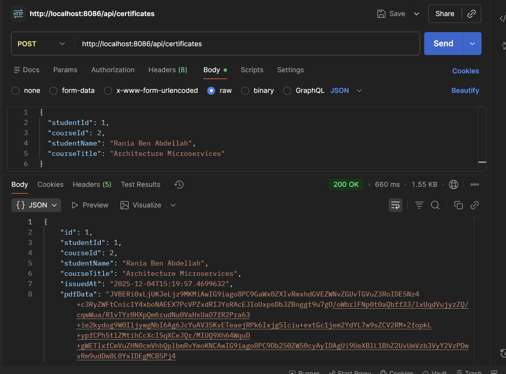
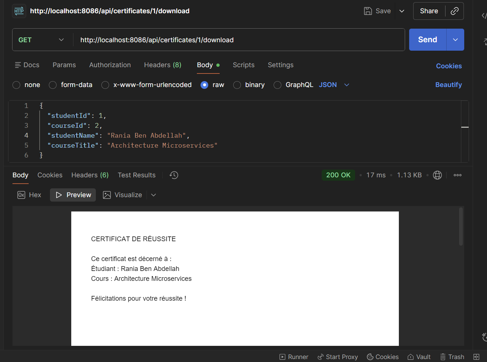

Interface Front-End (React + Vite)

L’interface utilisateur de la plateforme E-Learning a été développée avec React (via Vite) afin d’offrir une expérience fluide, moderne et responsive.
Elle permet d’interagir avec l’ensemble des microservices exposés par le backend : cours, enseignants, étudiants, inscriptions et certificats.

✨ Page d’accueil (Landing Page)

La page d’accueil a été entièrement travaillée pour reproduire une expérience similaire à Moodle, avec :

Une section Hero présentant la plateforme

Un bandeau introductif avec texte descriptif

Deux boutons d’action :

Voir les cours

Rencontrer les enseignants

Un visuel central représentant les microservices (architecture)

Une section “Statistiques” affichant des données clés :

Nombre de cours

Nombre d’enseignants

Profil des étudiants

Gestion des certificats PDF

Cette page sert de porte d’entrée principale vers les différents modules de l’application.

🎛️ Navigation globale

Une barre de navigation est incluse dans toutes les pages :

Accueil

Cours

Enseignants

Étudiants

Inscriptions

Certificats

L’état actif utilise NavLink pour un surlignage automatique.

📄 Pages disponibles
Chaque microservice expose une page dédiée :

| Page            | Fonctionnalité            | Microservice concerné |
| --------------- | ------------------------- | --------------------- |
| `/courses`      | Liste des cours           | course-service        |
| `/teachers`     | Professeurs               | teacher-service       |
| `/students`     | Étudiants                 | student-service       |
| `/enrollments`  | Inscriptions              | enrollment-service    |
| `/certificates` | Liste/gestion certificats | certificate-service   |

Structure du Front-End

frontend/
│── src/
│   │── pages/
│   │   ├── Home.jsx
│   │   ├── Courses.jsx
│   │   ├── Teachers.jsx
│   │   ├── Students.jsx
│   │   └── Enrollments.jsx
│   │── App.jsx
│   │── App.css
│   └── main.jsx
│
└── index.html

Launch du Front-End
cd frontend
npm install
npm run dev

Application accessible sur :
 http://localhost:5173